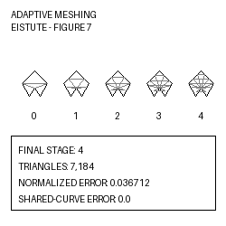

# Adaptive Meshing of Non-Manifold Parametric Patch Complexes

Replication package for the article **Adaptive Meshing of Non-Manifold Parametric Patch Complexes with Shared-Curve Compatibility**, accepted in *Computers & Graphics* through the SIBGRAPI 2026 Journal Track (manuscript CAG-D-26-00358R2).

The package contains the C++17 implementation, the Book, Eistute and Decor Shelf evaluation models, article and ablation configurations, and scripts for executing the three representative model runs.



## GRSI representative result

The GRSI reproduction target is **Figure 7**, Section 4.3, “Eistute model”. The figure presents five saved mesh states numbered 0, 1, 2, 3 and 4. The final target is stage 4.

| Metric | Archived value |
|---|---:|
| Triangles | 7,184 |
| Normalized error | 0.036712 |
| Error reduction | 96.3288% |
| Triangles with quality q >= 0.60 | 58.6303% |
| Recorded mean shared-curve compatibility error | 0.0 |

The reproduction scripts run without parameters, compile the implementation, execute the Eistute configuration and verify the generated stage-4 OBJ against the archived triangle-count target.

## Supported platform for GRSI review

The primary supported review platform is:

- Windows 10 or Windows 11, 64-bit;
- MSYS2 UCRT64 toolchain;
- CMake;
- GCC/MinGW-w64 with C++17 support;
- Python 3.

Eigen headers required by the implementation are bundled under `libs/Eigen/`.

For a clean Windows installation, follow [`INSTALL_WINDOWS.txt`](INSTALL_WINDOWS.txt).

## Quick reproduction — Figure 7

### Windows

Open PowerShell in the repository root and run:

```powershell
.\reproduce_eistute_windows.bat
```

### Linux

Linux execution is provided as an additional convenience but is not the primary GRSI review platform:

```bash
./reproduce_eistute_linux.sh
```

Expected final output:

```text
Eistute final stage verified: 4
Triangles: 7184
Published Eistute target triangle count verified.
Representative Eistute result reproduced successfully.
```

Generated data are written under:

```text
results/eistute/
```

The representative triangular mesh is an OBJ file whose name ends with:

```text
passo_4_malha_4.obj
```

The OBJ file is the standard text-format mesh data used to create the representative paper figure.

## Verify the archived reference

This validation does not execute the meshing algorithm. It verifies the archived OBJ and CSV against the JSON target:

```powershell
python scripts\verify_reference.py
```

## Run all three models

### Windows

```powershell
.\run_grsi.bat
```

### Linux

```bash
./run_grsi.sh
```

Results are written under:

- `results/book/`;
- `results/eistute/`;
- `results/decor_shelf/`.

Book and Decor Shelf currently have structural execution checks. The archived exact numerical target used for GRSI validation is the Eistute stage-4 result.

## Run one model

Windows:

```powershell
.\scripts\run_book_windows.bat
.\scripts\run_eistute_windows.bat
.\scripts\run_decor_shelf_windows.bat
```

Linux:

```bash
./scripts/run_book_linux.sh
./scripts/run_eistute_linux.sh
./scripts/run_decor_shelf_linux.sh
```

## GRSI submission files

- `GRSI_SUBMISSION.txt`: paper, authors, supported OS and representative result;
- `GRSI_LIABILITY.txt`: authorization for review and public advertisement after approval;
- `INSTALL_WINDOWS.txt`: clean-machine installation and compilation instructions;
- `DATA_PROVENANCE.md`: input-model provenance and redistribution declaration;
- `GRSI_FORM_VALUES.txt`: values prepared for the online submission form;
- `docs/GRSI_REVIEW_GUIDE.md`: reviewer-oriented workflow;
- `assets/grsi_representative.png`: 250 × 250 representative image;
- `paper/README.md`: instructions for providing a direct preprint PDF URL.

## Environment report

After installing the dependencies, generate the tested-environment record:

```powershell
powershell -ExecutionPolicy Bypass -File .\scripts\collect_environment_windows.ps1
```

This creates `TESTED_ENVIRONMENT.txt`.

## Package validation

Run:

```powershell
python .\scripts\validate_grsi_package.py
```

Before the final commit, regenerate and validate `MANIFEST.sha256` using the scripts under `scripts/`.

## Repository structure

- `src/`, `include/`: scientific implementation;
- `libs/Eigen/`: bundled Eigen headers retained from the experimental snapshot;
- `input_models/`: article evaluation models;
- `configs/`: article and ablation configurations;
- `reference/`: archived Eistute reference data;
- `scripts/`: build, execution and verification scripts;
- `assets/`: representative submission image;
- `paper/`: direct-preprint placement instructions;
- `docs/`: provenance and reproducibility notes.

## License

The source code is distributed under the MIT License. Third-party notices are documented in `THIRD_PARTY_LICENSES.md`. Input-model provenance and redistribution terms are documented in `DATA_PROVENANCE.md`.

## Provenance

The scientific source code, models and configurations were derived exclusively from the archived experimental snapshot identified in `SOURCE_SNAPSHOT.txt`. Later development branches were not incorporated.
